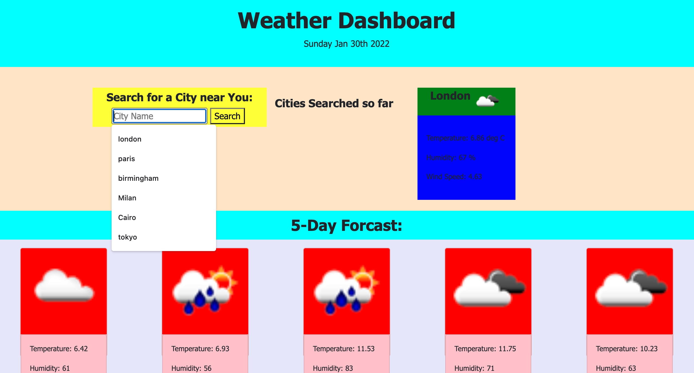

# Moments

## Description

A Weather Dashboard with a 5-day forcast.
<br><br>


## Functionality

The dashboard allows the user to choose a city and see the weather for that day. The weather markers used are as follows.

- Temperature    
- Huumidity  
- Wind Speed
- UV rays


```
 The Dashboard also offers a 5 day forcast for the chosen city.

 ```

### Initial steps

- Read the Brief
- Clarify the acceptance criteria.
 <br><br>
 <p> 
 The image below shows the Dashboard
 </p>



<br><br>

### Executing program

- Log into Github
- Create a new Repository  
- Open Terminal and navigate to where the respository will sit on the local computer.
- Copy the repository key to the local computer using 'Git clone'.
- Open the repository in VS Code using 'code .' in the terminal
- In VS Code add and edit files as per convention.
- Use 'git add .',  followed by 'git commit -m "notes"', then 'git push'

```
clone, add, commit, push, status
```
<br><br>
## Help
```
For advice on common problems or issues related to this project, please contact the author. 

```
## Authors
- Jean McLeod
- Slack @AbriCS
- Tweet [@AbriCSltd](https://twitter.com/AbriCSltd)
<br>

## Version History

- <b>0.2  The Latest<b>
    - Click [here](https://abrics.github.io/Weather-Now/) for the final release. 2022/01/30.
- 0.1
  - Initial Release 2022/01/27
<br><br>
 
## License

This project is licensed under the [Creative Commons](https://creativecommons.org/licenses/by/2.0/uk/) Licence and is free to use and develop. Citation of the Author is recommended.
<br><br>
 
## Acknowledgments
https://openweathermap.org/api
<br>
[awesome-readme](https://github.com/matiassingers/awesome-readme)


